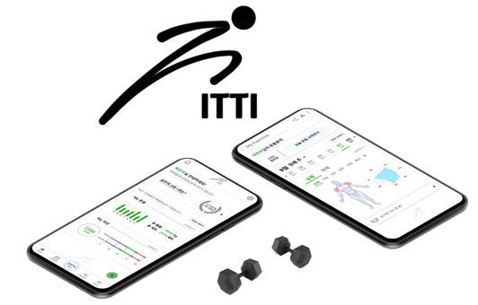
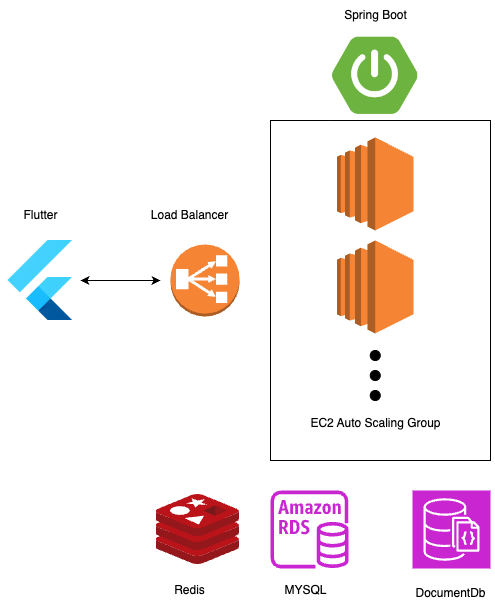
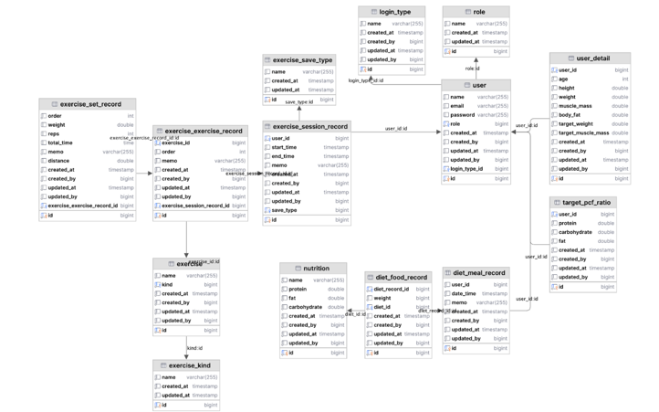

# Fitti-Backend
--------------------------

## How to start?

아래 링크를 참조하세요.\
https://fitti.atlassian.net/l/cp/YD5okCwd

## Description

헬스 운동 종목 루틴과 식단 관리 기능을 제공하는 피트니스 어플리케이션의 백엔드 파트입니다.
주요 기능은 다음과 같습니다.

- 회원가입 및 로그인 (JWT & OAUTH2)
- 운동 종목 추가 및 수정
- 루틴 생성 및 수정
- 식단 메뉴 추가 및 수정
- 식단 계획 생성 및 수정
- 랭킹
- 친구 추가 및 친구의 루틴 및 식단 조회 그리고 커멘트
- 피트니스 커뮤니티 게시판

## Tech Architecture

다음은 백엔드의 기술 아키텍처입니다.AWS의 EC2 인스턴스에 Github Actions를 이용하여 CI/CD를 구축하였습니다.
확장성에 대한 테스트는 이후에 진행할 예정입니다.

## ERD

다음은 백엔드의 ERD입니다.

아래의 컨벤션 문서를 참조해 주세요. 자기 마음대로 고치면 안됩니다!!
https://fitti.atlassian.net/wiki/spaces/NyangNyang/pages/7733318/DB

유저 정보 테이블과 운동 관련 테이블, 식단 관련 테이블로 구성되어 있습니다.

## 코드 컨벤션

1. 로직 분리와 순환참조를 방지하기 위해 프로젝트 구조를 다음과 같이 설계합니다.

- Presentation(Controller) → (Facade) → Service → Repository 구조
- Service는 Repo만 주입 가능
- Facade는 Service만 주입 가능, 로직 상 하나의 Entity(Repository)만 요구시 Facade 생략 가능
- Presnetation은 Service, Facade 주입 가능.

2. Service, Repository 함수의 경우: 보통 1개의 Entitiy와 관련된 로직이므로 함수이름에서 목적어를 삭제하여 Naming 단순화

- 조회시: get, listBy, listBetween, etc…
- 생성시: create, createBy, etc ….
- 수정시: update, updateBy, etc….
- 삭제시: delete, deleteAllBy, etc….

3. Facade, Controller 함수의 경우:  함수 이름에 목적어 기입하여 의도를 표현

- getPcfRetioBetween, deleteExerciseSessionRecord, etc…

4. DTO 변환은 Service Layer에서 Mapstruct을 사용.

- Proxy 객체 방지 / DTO 변환 자동화

5. OneToMany에서 Many조회의 경우, Graphql의 Batch Mapping 사용

- N + 1 방지
- Fetch Join의 Over Fetching을 방지 가능.

----

# CI/CD 구축

- Github Action 을 사용하여 AWS에 배포
- Kover Test Code Coverage 측정 (100미만일시 병합 불가능)
- Pull Request Or Merge시 Jira Issue 상태 연동 (to do → pullrequest → merge)
- Ec2 Auto Scaling Group을 통해 Scalability 보장(구현 예정)

